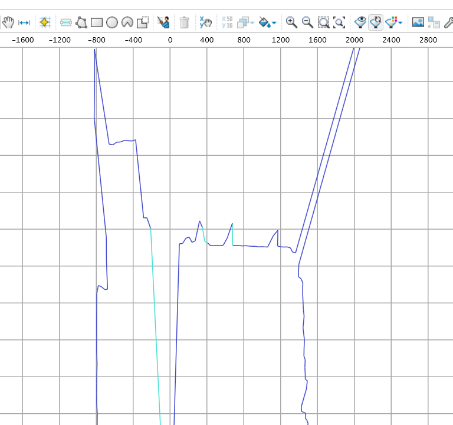
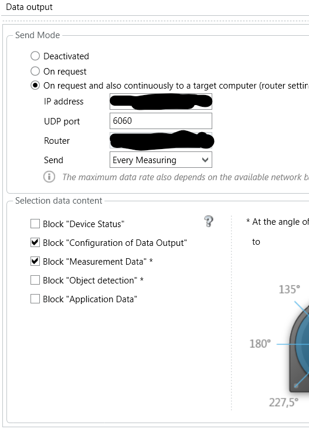
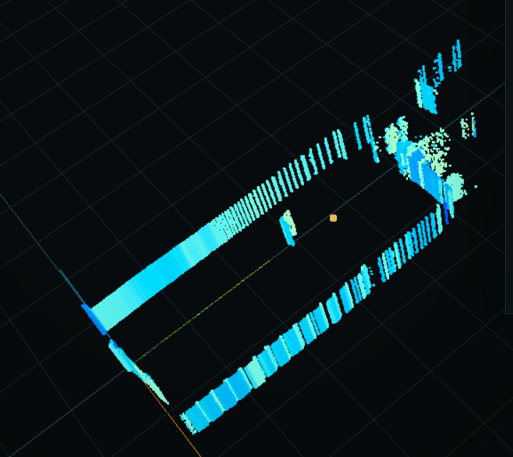
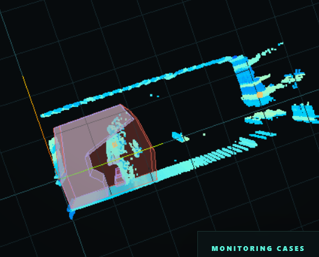

Current Terriable style, when I tune the position, so hard to tell if it's the edge. Bad design.

Step 1 change your config

Step 2 Config your local ip address, and make sure it could capture UDP through 6060 port
you can run `getdata.py` to test

Step 3 Run python script to get CloudPoints
pointcloud.py

Step 4 Save the dection area file, the format should be *.sdmxl

Step 5 npm run dev and good to anlysis. Easy coding easy life.

if you like please thumb me with a star :)

Do you see me? hahaha
